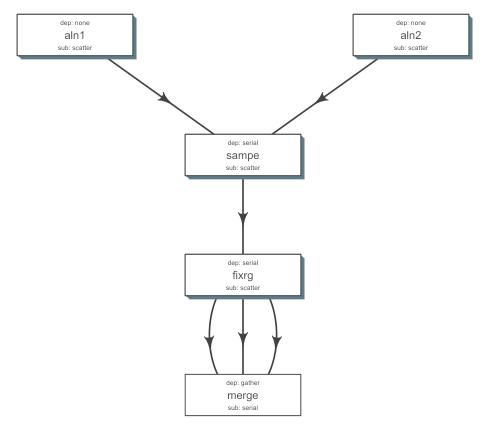

# 


<br>
<br>

[](https://travis-ci.org/sahilseth/flowr)
[](http://cran.rstudio.com/web/packages/flowr/index.html)
[](http://codecov.io/github/sahilseth/flowr?branch=devel)

<!---->

<center> <h4><font color="#D3003A">
[ Streamlining Workflows](http://docs.flowr.space)
</font></h4> </center>

This framework allows you to design and implement complex pipelines, and
deploy them on your institution's computing cluster. This has been built
keeping in mind the needs of bioinformatics workflows. However, it is
easily extendable to any field where a series of steps (shell commands)
are to be executed in a (work)flow to process big data.

### Highlights


<!--	- Consider step 1 uses 10 cores for each file; with 50 files it would use 500 cores in total.
	- Next step uses one core for each file, 50 cores in total.
	- Say step C merges them, and uses only 1 core.-->

- No new **syntax or language**. Put all shell commands as a tsv file called [flow mat](http://docs.flowr.space/overview.html#flow_mat).
- Define the [flow of steps](http://docs.flowr.space/overview.html#relationships) using a simple tsv file (serial, scatter, gather, burst...) called [flow def](http://docs.flowr.space/overview.html#flow_definition).
- Works on you laptop/server or cluster (/cloud).
- Supports **multiple cluster computing platforms** (torque, lsf, sge, slurm ...), cloud (star cluster) OR a local machine.
- One line installation (`install.packages("flowr")`)
-   **Reproducible** and **transparent**, with cleanly structured execution logs
-   **Track** and **re-run** flows
-   **Lean** and **Portable**, with easy installation
- **Fine grain** control over resources (CPU, memory, walltime of each step.

<!--
- Effectively process a **multi-step pipeline**, spawning it
across the computing cluster
- Example: 
	- A typical case in next-generation sequencing involves processing of tens of
   [fastqs](http://en.wikipedia.org/wiki/FASTQ_format) for a sample,
   [mapping](http://en.wikipedia.org/wiki/Sequence_alignment) them to a reference genome.
	- Each step requires a range resources in terms of CPU, RAM etc.
	- Some pipelines may reserve the maximum, example say 500 cores throught all the steps
	- flowr would handle the **surge**, reserving 500, 50 or 1; when needed.
	- Now consider the run has 10 samples, all of them would be procesed in
	 parallel, spawning **thousands of cores**.
-   **Reproducible** and **transparent**, with cleanly structured execution logs
-   **Track** and **re-run** flows
-   **Lean** and **Portable**, with easy installation
-->

<iframe width="640" height="480" src="https://www.youtube.com/embed/szDNFioBdPo?rel=0&amp;showinfo=0;autoplay=1;start=29;speed=2" frameborder="0" volume="0"></iframe>

### Example
[](http://rpubs.com/sahiilseth/flowr_fq_bam)


### A few lines, to get started


```r
## Latest stable release from CRAN (updated every other month)
## visit docs.flowr.space/install for more details
install.packages("flowr")

library(flowr) ## load the library
setup() ## copy flowr bash script; and create a folder flowr under home.

## Run an example pipeline
flowr run x=sleep_pipe platform=local execute=TRUE
```

### Resources
- For a quick overview, you may browse through,
 these [introductory slides](http://sahilseth.github.io/slides/flowrintro).
- The [overview](http://docs.flowr.space/docs.html) provides additional details regarding
the ideas and concepts used in flowr
- We have a [tutorial](http://docs.flowr.space/tutorial.html) which can walk you through creating a
new pipeline
- We have a [tutorial](http://docs.flowr.space/tutorial.html) which can walk you through creating a
new pipeline
- Additionally, a subset of important functions are described in the [package reference](http://docs.flowr.space/rd.html)
page
- You may follow detailed instructions on [installing and configuring](http://docs.flowr.space/install.html)
- You can use [flow creator](https://sseth.shinyapps.io/flow_creator), a shiny app to aid in
	designing a *shiny* new flow. This provides a good example of the concepts


### Troubleshooting

- Refer to the [advanced configuration](http://docs.flowr.space/install.html#troubleshooting) section or post issues on github's issues page.

### Talks/Slides
- Updated [introduction](http://sahilseth.github.io/slides/flowrintro/index.html) (Sep, 2015)
- An earlier [introduction](http://sahilseth.github.io/slides/flowrintro/index_20150706) at 
MD Anderson Comp. Biology meeting (July, 2015)


### Acknowledgements

-   Andy Futreal
-   Jianhua Zhang
-   Samir Amin
-   Roger Moye
-   Kadir Akdemir
-   Ethan Mao
-   Henry Song
-   An excellent resource for writing your own R packages:
    [r-pkgs.had.co.nz](r-pkgs.had.co.nz)

<!--why this license http://kbroman.org/pkg_primer/pages/licenses.html -->
<script src = "files/googl.js"></script>
